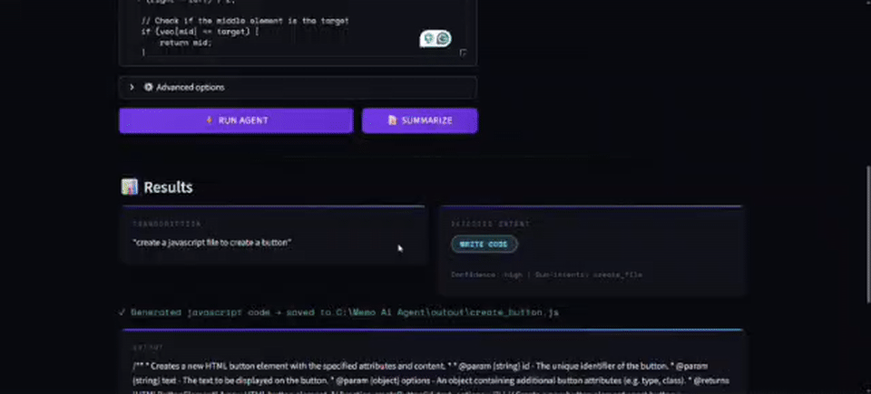

# VoiceAgent


Local-first voice automation agent: speak or type a command, classify intent, execute tools, and return structured output with safety guards.

## Demo



> Replace `docs/demo.gif` with your recorded UI run-through (recommended: 20-40 seconds showing voice input, confirm flow, and output).

## Architecture

```text
+-----------------------+       +--------------------------+
|  Input Layer          |       |  Memory Layer (Optional) |
|  - Mic audio          | ----> |  Mem0 retrieval context  |
|  - File upload        |       +-------------+------------+
|  - Text command       |                     |
+-----------+-----------+                     v
            |                         +-------+----------------+
            v                         | Intent Classification  |
+-----------+-----------+             | - Ollama LLM          |
| Speech-to-Text Engine | --------->  | - Rule fallback       |
| - faster-whisper      |             +-------+----------------+
| - Groq fallback       |                     |
+-----------+-----------+                     v
            |                         +-------+----------------+
            |                         | Tool Executor          |
            |                         | - write_code           |
            |                         | - create_file          |
            |                         | - summarize_text       |
            |                         | - general_chat         |
            |                         +-------+----------------+
            |                                 |
            v                                 v
+-----------+---------------------------------+---------------+
| Streamlit UI                                                |
| - Pipeline status  - Confirmation gate  - Result rendering |
+-------------------------------------------------------------+
```

## How It Works

1. Input capture
The app accepts microphone recordings, uploaded audio, or direct text commands.

2. Speech transcription
Audio is transcribed with local `faster-whisper`; if configured, Groq Whisper can be used as fallback.

3. Intent classification
The transcribed command is classified via Ollama (`/api/generate` + `/api/chat` fallback). If unavailable, deterministic rules classify intent.

4. Safety and confirmation
File-writing intents require explicit user confirmation before execution.

5. Tool execution
The executor runs the mapped action (`write_code`, `create_file`, `summarize_text`, `general_chat`) and stores all writes under `output/`.

6. Result + memory update
The UI displays transcription, intent, confidence, and output; memory providers can store compact interaction facts for future context.

## Why faster-whisper Over Original Whisper?

> [!NOTE]
> `faster-whisper` is built on CTranslate2 and is typically much faster and lighter for CPU-bound local inference.
>
> Practical reasons for this project:
> - Lower latency on commodity hardware
> - Better throughput for repeated transcription in an interactive UI
> - Easier local deployment without requiring GPU acceleration
>
> This keeps the app responsive while preserving a local-first architecture.

## Features

- Local-first LLM integration through Ollama
- Multi-input UX (mic, file, typed command)
- Intent fallback path for degraded environments
- Human-in-the-loop confirmation for write operations
- Sandboxed file output under `output/`
- Optional semantic memory integration with Mem0

## Quick Start

```bash
python -m venv .venv
.venv\Scripts\activate
pip install -r requirements.txt
copy .env.example .env
```

Run Ollama and pull a model:

```bash
ollama serve
ollama pull llama3.2
```

Start the app:

```bash
.venv\Scripts\python.exe -m streamlit run app.py
```

## Configuration

Key environment variables in `.env`:

- `OLLAMA_URL`: Ollama server URL (default `http://localhost:11434`)
- `OLLAMA_MODEL`: model name (default `llama3.2`)
- `OLLAMA_TIMEOUT_SECONDS`: request timeout budget
- `OLLAMA_MAX_RETRIES`: retry count for transient timeouts
- `WHISPER_MODEL_SIZE`: local STT model size (`tiny|base|small|medium|large-v3`)
- `GROQ_API_KEY`: optional cloud STT fallback
- `MEM0_API_KEY`: optional memory integration

## Repository Layout

```text
.
|-- app.py
|-- intent.py
|-- executor.py
|-- stt.py
|-- tools/
|   `-- executor.py
|-- utils/
|   |-- intent.py
|   |-- stt.py
|   `-- memory.py
|-- output/
|-- requirements.txt
`-- .github/workflows/ci.yml
```

## Roadmap

- Add first-class test suite for intent and executor behaviors
- Add latency telemetry panel in Streamlit UI
- Add deterministic integration fixtures for article benchmarks

## Contributing

See `CONTRIBUTING.md` for setup, style, and pull request guidance.
